# LE-SOFT Software Blueprint

Generated: 2026-05-21  
Project version inspected: `1.4.0`  
Scope: Architecture, data model, routes, workflows, IPC/API surface, build pipelines, and operational notes.  
Source of truth inspected: `package.json`, `src/App.tsx`, `src/components/DashboardLayout.tsx`, `electron/*`, `.github/workflows/*`, and Supabase migrations `001` through `043`.

This document is documentation only. It does not change runtime code.

---

## 1. Executive Summary

LE-SOFT is an Electron desktop ERP application built with React, Vite, TypeScript, Supabase/PostgreSQL, and local SQLite support. It covers:

- Accounting masters: groups, ledgers, voucher types, vouchers, purchase bills, suppliers.
- Inventory masters: products, units, stock groups, godowns, product ledger, model rules, product attributes, damaged goods.
- Purchase requisition workflow: store request, store head approval, accounts estimate, audit, director approval, purchase, receipt, completion.
- Billing/POS: customer creation, invoice creation, bill alteration, pending approvals, customer ledger, quotations, exchanges.
- CRM: customer directory, follow-up tracking, ledger merge into billing customers.
- HRM: employees, attendance, leave, payroll.
- MAKE: production/order workflow.
- Shipping: shipment payment/packing/shipping/delivery lifecycle.
- Website integration: products, orders, categories, projects, pages, media, newsletter, settings.
- Users and security: users, groups, permission levels, active sessions, notifications, audit logs.
- Release pipeline: Electron Builder packages for macOS and Windows, GitHub Releases, electron-updater metadata.

The application is desktop-first. The renderer never talks directly to Node APIs. React pages call `window.electron` functions exposed through `preload.ts`; the Electron main process handles Supabase reads/writes, encryption, local cache, offline queue, filesystem operations, backups, email, and updates.

---

## 2. Technology Stack

| Layer | Technology | Purpose |
|---|---|---|
| Desktop shell | Electron | Native desktop app for macOS and Windows |
| Frontend | React 18, TypeScript, Vite | Renderer UI and routing |
| UI libraries | Lucide React, Framer Motion | Icons and animation |
| Main database | Supabase PostgreSQL | Primary business data store |
| Local offline layer | better-sqlite3 | Offline table cache and persistent write queue |
| Data access | `@supabase/supabase-js` | Supabase client in Electron main process |
| Packaging | electron-builder | NSIS Windows installer, macOS DMG/ZIP |
| Updates | electron-updater | Reads GitHub Release metadata |
| Reports/exports | jsPDF, html2canvas, ExcelJS, XLSX | PDF/image/export/report functionality |
| Website sync | mysql2 | External website/MySQL integration |
| Mail | nodemailer | Outgoing email |
| Security | bcryptjs, AES-256-GCM field encryption | Password hashing and encrypted data fields |

---

## 3. Runtime Architecture

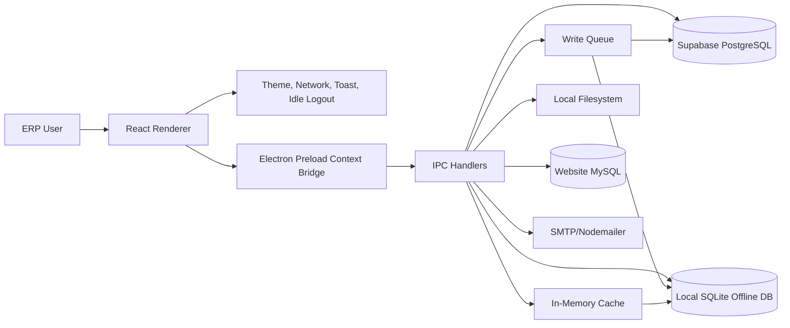

### Key Runtime Rules

- `src` contains the React application and UI routes.
- `electron/preload.ts` exposes safe APIs through `contextBridge`.
- `electron/ipc-handlers.ts` owns most business operations.
- `electron/supabase.ts` initializes Supabase clients from OS user-data config.
- `electron/field-encryption.ts` encrypts/decrypts most data fields before Supabase persistence.
- `electron/cache-manager.ts` preloads high-traffic data after login and stores fallback cache in SQLite.
- `electron/write-queue.ts` provides non-blocking writes, retries, offline persistence, and renderer refresh signals.
- `electron/offline-db.ts` stores `table_cache` and `sync_queue`.
- Supabase is the source of truth; SQLite is a cache/queue, not the canonical database.

---

## 4. Source Tree Map

| Path | Purpose |
|---|---|
| `src/App.tsx` | Main route tree, protected routes, global providers, shortcuts |
| `src/components/DashboardLayout.tsx` | Sidebar, notification dropdown, live clock, permission-driven navigation |
| `src/components/ProtectedRoute.tsx` | Role and permission guard |
| `src/context/*` | Theme, network, toast state |
| `src/hooks/useIdleLogout.ts` | Auto logout behavior |
| `src/pages/Auth` | Login, license gate, first-time setup |
| `src/pages/Dashboard` | Overview dashboard |
| `src/pages/Accounting` | Groups, ledgers, suppliers, vouchers, purchase bills |
| `src/pages/Inventory/Masters` | Products, stock groups, units, godowns, PR, damaged goods |
| `src/pages/Billing` | POS, bill history, bill alteration approvals |
| `src/pages/CRM` | CRM directory, customer ledger, exchanges |
| `src/pages/HRM` | Employees, attendance, leave, payroll |
| `src/pages/Make` | Production order workflow |
| `src/pages/Shipping` | Shipping dashboard and status lifecycle |
| `src/pages/Website` | Website admin/sync pages |
| `src/pages/Users` | Users, user groups, permission levels, active sessions |
| `src/pages/Reports` | Accounting, stock, product, market analysis reports |
| `src/pages/Settings` | System settings, Supabase admin key, backups, print settings |
| `electron/main.ts` | App startup, window, updater, database/cache/queue initialization |
| `electron/preload.ts` | Renderer API bridge |
| `electron/ipc-handlers.ts` | Main backend/business API surface |
| `electron/supabase.ts` | Supabase client config |
| `electron/offline-db.ts` | SQLite cache and sync queue |
| `electron/write-queue.ts` | Async/offline write buffer |
| `electron/cache-manager.ts` | In-memory and offline table cache |
| `electron/field-encryption.ts` | Field-level AES encryption |
| `supabase/migrations` | Database schema and policy evolution |
| `supabase/tests` | Manual SQL smoke/integration tests |
| `.github/workflows` | CI build/release pipelines |
| `release` | Local build artifacts |

---

## 5. Route Map

### Public and Shell Routes

| Route | Page | Notes |
|---|---|---|
| `/` | Login | Public entry |
| `/login` | Login | Alias |
| `/setup` | Setup Screen | Supabase/license setup |
| `/dashboard` | Dashboard | Protected overview |
| `/notifications` | Notifications | Dynamic notification routing support |
| `/settings` | Settings | `manage_settings` permission |

### Masters Routes

| Route | Page |
|---|---|
| `/masters` | Masters hub |
| `/masters/groups` | Account group list |
| `/masters/groups/create` | Create account group |
| `/masters/ledgers` | Ledger list |
| `/masters/ledgers/create` | Create ledger |
| `/masters/suppliers` | Supplier management |
| `/masters/suppliers/ledger/:id` | Supplier ledger detail |
| `/masters/voucher-types` | Voucher types placeholder |
| `/masters/currencies` | Currencies placeholder |
| `/masters/units` | Unit list |
| `/masters/units/create` | Create unit |
| `/masters/stock-groups` | Stock group list/tree |
| `/masters/stock-groups/create` | Create stock group |
| `/masters/stock-items` | Stock items |
| `/masters/stock-items/create` | Create stock item |
| `/masters/products` | Product list |
| `/masters/products/create` | Product create/edit entry |
| `/masters/products/:id/ledger` | Product ledger |
| `/masters/product-model-rules` | Product model rule management |
| `/masters/product-attributes` | Product attribute/spec definition |
| `/masters/damaged-goods` | Damaged goods workflow/report |
| `/masters/purchase-requisitions` | Purchase requisition workflow |
| `/masters/godowns` | Godown/warehouse management |

### Accounting and Reports Routes

| Route | Page |
|---|---|
| `/vouchers` | Voucher list |
| `/vouchers/create` | Voucher entry |
| `/vouchers/purchase-bill` | Purchase bill list |
| `/vouchers/purchase-bill/create` | Purchase bill create |
| `/reports/trial-balance` | Trial balance |
| `/reports/balance-sheet` | Balance sheet |
| `/reports/profit-and-loss` | Profit and loss |
| `/reports/stock-summary` | Stock summary |
| `/reports/day-book` | Day book |
| `/reports/market-analysis` | Market analysis |
| `/reports/product-history` | Product history |

### Billing, CRM, Website, Users, HRM, MAKE

| Domain | Routes |
|---|---|
| Billing/POS | `/billing`, `/billing/history`, `/billing/alter`, `/billing/pending-approvals` |
| CRM | `/billing/crm/directory`, `/billing/crm/progress`, `/crm/ledger`, `/crm/ledger/:id`, `/crm/exchanges`, `/crm/exchanges/create` |
| Quotations | `/quotations`, `/quotations/create`, `/quotations/preview/:id` |
| Users | `/users`, `/users/create`, `/users/groups`, `/users/groups/create`, `/users/active`, `/users/permissions` |
| HRM | `/hrm`, `/hrm/employees`, `/hrm/attendance`, `/hrm/leaves`, `/hrm/payroll` |
| MAKE | `/make`, `/make/dashboard`, `/make/place-order`, `/make/track` |
| Website | `/website`, `/website/products`, `/website/orders`, `/website/categories`, `/website/projects`, `/website/pages`, `/website/media`, `/website/newsletter`, `/website/settings` |
| Shipping | `/shipping` |

---

## 6. Module Blueprint

### 6.1 Authentication, License, Sessions

- Login reads users from Supabase through Electron IPC.
- `ProtectedRoute` checks:
  - `user_role` in `localStorage`.
  - `user_id` exists to avoid stale sessions.
  - `allowedRoles` if supplied.
  - `permissionKey` if supplied.
- `superadmin` bypasses route permission checks.
- License setup can decrypt embedded Supabase credentials and stores config under Electron `userData`.
- Active sessions use user/device presence data and device session records.
- Logout preserves local device settings such as license key, barcode settings, theme, auto logout, and per-print page sizes.

### 6.2 Permission System

Core tables:

- `users`
- `user_groups`
- `permission_levels`

Frontend navigation is permission-driven. Examples:

- `read_bill`, `write_bill`, `alter_bill`, `approve_bill`
- `read_group`, `read_ledger`, `read_stock_items`
- `read_purchase_requisition`
- `read_product_ledger`
- `manage_product_model_rules`
- `manage_product_attributes`
- `read_damaged_goods`
- `manage_damaged_goods`
- `manage_users`, `manage_groups`, `manage_permissions`
- `manage_shipping`, `manage_website`, `manage_settings`

Purchase requisition workflow steps are stored in `permission_levels` using:

- `workflow_key = 'purchase_requisition'`
- `workflow_step`

### 6.3 Accounting Masters

Accounting data starts with `groups` and `ledgers`.

- `groups` support hierarchy through `parent_id`.
- `ledgers` belong to groups and may represent customers, suppliers, cash, bank, etc.
- Supplier management extends ledgers with supplier/contact/payment fields.
- Vouchers use `vouchers` and `voucher_entries`.
- Purchase bills use `purchase_bills` and `purchase_bill_items`.

### 6.4 Products and Inventory

Product storage is centered on `products`, `units`, `stock_groups`, and `godowns`.

Current product capabilities include:

- Auto-generated `product_code` / `model_number`.
- Dynamic product origins through `product_origins`.
- Product model rules through `product_model_rules`.
- Attribute/spec metadata through `product_attributes`.
- Per-product attribute values through `product_attribute_values`.
- Supplier and import details through product supplier/import columns.
- Picture gallery through `image_gallery`.
- Low stock alert threshold and enabled flag.
- Product ledger page linking stock, purchase, suppliers, requisitions, price history, attributes, gallery, and damaged goods.

Important rule:

- Imported products require special permission/superadmin flow.
- Other origins are dynamic, but imported origin remains privileged.

### 6.5 Stock Groups

`stock_groups` can be hierarchical by `parent_id`.

Example:

- `Light`
  - `Chandelier`

The stock group page should present this as a tree, not just a flat list. Products are linked to stock groups with `products.stock_group_id`.

### 6.6 Godowns and Warehouse

`godowns` stores warehouse names and layout dimensions.

Warehouse fields include:

- `total_rows`
- `racks_per_row`
- `bins_per_rack`

Products store location fields:

- `godown_id`
- `location_row`
- `location_rack`
- `location_bin`

### 6.7 Purchase Requisition Workflow

Business process:

1. Store department creates a requisition.
2. Store head reviews, edits if needed, and approves.
3. Accounts adds vendor/supplier and approximate price.
4. Audit reviews and adds audit justification.
5. Director approves or rejects based on audit.
6. Purchase department prints approved requisition and records purchase details.
7. Receiving team records goods received.
8. Inventory/store completes stock posting.

Core tables:

- `purchase_requisitions`
- `purchase_requisition_items`
- `purchase_requisition_quotes`
- `purchase_requisition_approvals`
- `purchase_requisition_status_history`
- `supplier_settlements`

Important status values:

- `DRAFT`
- `PENDING_ESTIMATE`
- `PENDING_AUDIT`
- `PENDING_DIRECTOR`
- `APPROVED`
- `PURCHASED`
- `RECEIVED`
- `COMPLETED`
- `REJECTED`

The requisition list should not flatten multiple product lines into one product column. Details belong in the view/print panel. The print output should focus on products to purchase and supplier details.

### 6.8 Damaged Goods Workflow

Core table: `damaged_goods`

Supported lifecycle:

1. Stock is marked damaged from purchase receipt or manual discovery.
2. Damaged quantity is tracked separately from usable stock.
3. Damaged stock can move to repair.
4. If repaired, it is removed from damaged goods and usable stock can be restored.
5. If unrepaired, damaged stock is written off/adjusted.

Statuses:

- `DAMAGED`
- `IN_REPAIR`
- `REPAIRED`
- `WRITTEN_OFF`

Access should be permission-controlled. Inventory manager/admin/superadmin are the primary operational groups for transfer and updates.

### 6.9 Low Stock Alerts and Notifications

Products have:

- `low_stock_threshold`
- `low_stock_alert_enabled`

Notifications have route metadata:

- `action_path`
- `action_label`
- `notification_key`
- `metadata`

Notification clicks are dynamic. `DashboardLayout` marks the notification as read and navigates to `notification.action_path`.

### 6.10 Billing/POS

Core tables:

- `billing_customers`
- `bills`
- `bill_items`
- `bill_audit`
- `bill_shipping`
- `shipping_status_log`
- `customer_addresses`
- `customer_payments`
- `exchange_orders`
- `exchange_items`
- `quotations`
- `quotation_items`

Key capabilities:

- Create customers and bills.
- Track bill alterations and approvals.
- Track shipping and payment verification.
- Customer ledger combines invoices, payments, returns/exchanges, quotations, and addresses.
- Quotations can be created and previewed.

### 6.11 HRM

Core tables:

- `hrm_employees`
- `hrm_attendance`
- `hrm_leaves`
- `hrm_payroll`

Capabilities:

- Employee records.
- Attendance.
- Leave requests/approval.
- Payroll viewing/processing.

### 6.12 CRM

Core tables:

- `billing_customers`
- `crm_customers`
- `crm_tracking`

Later migrations merge CRM metadata into billing customers:

- `company`
- `crm_interested_products`
- `crm_state`
- `crm_next_appointment`
- `crm_description`

### 6.13 MAKE

Core tables:

- `make_orders`
- `make_order_updates`
- `make_order_parts`
- `make_order_alteration_log`

Capabilities:

- Create production orders.
- Track orders.
- Assign/approve salesman workflow.
- Store parts, delivery date, PDF URLs, and alteration logs.

### 6.14 Email and Internal Chat

Core tables:

- `system_emails`
- `internal_messages`
- `app_chat_messages`
- `chat_typing_status`

Capabilities:

- Inbox/sent mail.
- Send/delete/mark messages.
- Internal chat.
- Typing status.

### 6.15 Website Integration

Website pages use MySQL/website configuration through Electron IPC. Covered areas:

- Dashboard
- Products
- Orders
- Categories
- Projects
- Pages
- Media
- Newsletter
- Settings
- CSV import and sync

### 6.16 Reports

Report domains:

- Trial balance
- Balance sheet
- Profit and loss
- Stock summary
- Day book
- Market analysis
- Product history

Reports are exposed from Electron IPC and rendered in React pages.

---

## 7. ERD

### 7.1 Core Accounting, Inventory, Billing

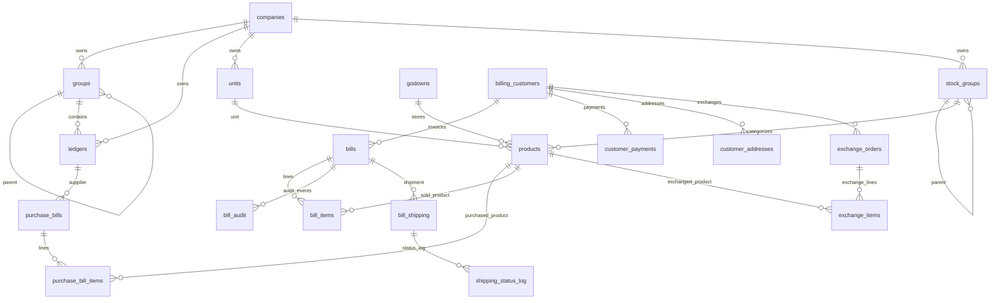

### 7.2 Purchase Requisition and Supplier Workflow

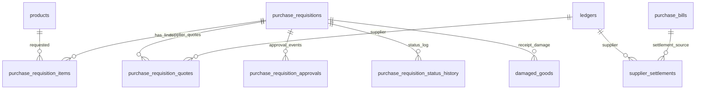

### 7.3 Product Ledger, Model Rules, Attributes, Damage

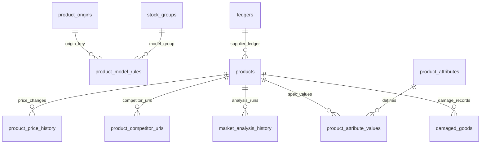

### 7.4 Users, Permissions, Notifications, Sessions

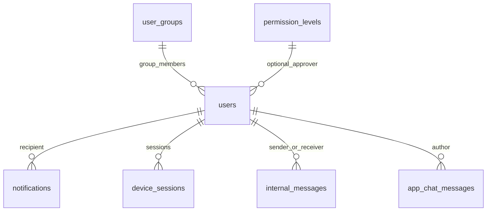

### 7.5 HRM, CRM, MAKE, Quotations

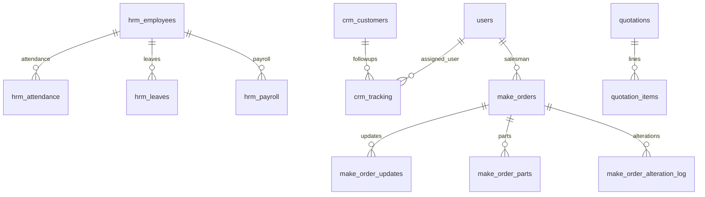

---

## 8. Data Dictionary

This dictionary lists the business purpose and important columns. See `supabase/migrations` for exact SQL types and constraints.

### 8.1 Company, Accounting, Masters

| Table | Purpose | Important columns | Notes |
|---|---|---|---|
| `companies` | Company/profile root | `id`, `name`, `address`, `phone`, `email`, `max_price_adjustment`, timestamps | Parent for most master data |
| `groups` | Accounting group tree | `id`, `name`, `nature`, `parent_id`, `company_id` | Self-referencing hierarchy |
| `ledgers` | Ledger/supplier/customer accounts | `id`, `name`, `group_id`, `opening_balance`, `balance_type`, supplier fields, `company_id` | Supplier fields added by migration `025` |
| `vouchers` | Accounting voucher header | `id`, `voucher_number`, `voucher_type`, `date`, `narration`, `company_id` | Parent of voucher entries |
| `voucher_entries` | Debit/credit voucher lines | `id`, `voucher_id`, `ledger_id`, `debit`, `credit` | Linked to ledgers |
| `units` | Product units | `id`, `name`, `symbol`, `company_id` | Used by products and PR quantities |
| `stock_groups` | Inventory category tree | `id`, `name`, `parent_id`, `company_id` | Supports visual hierarchy |
| `stock_items` | Legacy/basic stock item table | `id`, `name`, `unit_id`, `stock_group_id`, `quantity` | Product table is richer current model |
| `godowns` | Warehouses/storage | `id`, `name`, `location`, `total_rows`, `racks_per_row`, `bins_per_rack`, `company_id` | Warehouse dimensions repaired in migration `043` |

### 8.2 Products and Inventory

| Table | Purpose | Important columns | Notes |
|---|---|---|---|
| `products` | Product master | `id`, `name`, `sku`, `product_code`, `model_number`, `origin_type`, `unit_id`, `stock_group_id`, `godown_id`, `quantity`, `selling_price`, `cost_price`, location fields, import fields, `image_gallery`, `specs`, low stock fields | Main product ledger root |
| `product_origins` | Dynamic product origin list | `id`, `name`, `origin_key`, `requires_superadmin`, `is_active`, `company_id` | Imported remains privileged |
| `product_model_rules` | Model number generation rules | `id`, `name`, `origin_type`, `origin_code`, `stock_group_id`, `group_code`, `batch_sequence`, `serial_padding`, `is_active` | Used to generate model/product code |
| `product_attributes` | Product spec field definitions | `id`, `name`, `input_type`, `options`, `is_active` | Defines reusable attributes such as size/color |
| `product_attribute_values` | Per-product spec values | `id`, `product_id`, `attribute_id`, `value` | Unique per product and attribute |
| `product_price_history` | Product price change log | `id`, `product_id`, old/new price data, `changed_by`, timestamps | Supports product history report |
| `product_competitor_urls` | Market analysis targets | `id`, `product_id`, `url`, metadata | Used by AI/market analysis |
| `market_analysis_history` | Market analysis results | `id`, `product_id`, analysis payload, timestamps | Report/history table |
| `damaged_goods` | Damaged stock ledger | `id`, `product_id`, `source_requisition_id`, `source_type`, `quantity`, `status`, notes, actor names, timestamps | Tracks repair/write-off lifecycle |

### 8.3 Purchase and Supplier

| Table | Purpose | Important columns | Notes |
|---|---|---|---|
| `purchase_bills` | Supplier purchase invoice header | `id`, `bill_number`, `supplier_ledger_id`, `date`, totals, `company_id` | Linked to purchase bill items |
| `purchase_bill_items` | Supplier invoice lines | `id`, `purchase_bill_id`, `product_id`, `quantity`, `rate`, amount | Impacts product purchase history |
| `purchase_requisitions` | PR header/workflow state | `id`, `requisition_number`, legacy `product_id`/`quantity`, `priority_level`, `status`, audit/director/store fields, purchase/receive fields, `company_id` | Multi-product data lives in item table |
| `purchase_requisition_items` | PR product lines | `id`, `requisition_id`, `line_no`, `product_id`, `quantity`, `quantity_unit`, `company_id` | Needed for correct PR detail/print |
| `purchase_requisition_quotes` | Vendor/account estimates | `id`, `requisition_id`, `supplier_ledger_id`, `estimated_price`, `remarks` | Accounts department data |
| `purchase_requisition_approvals` | Approval records | `id`, `requisition_id`, approver/action/note fields, timestamps | Workflow audit trail |
| `purchase_requisition_status_history` | Status transition log | `id`, `requisition_id`, `from_status`, `to_status`, notes, actor, timestamp | Admin/superadmin audit visibility |
| `supplier_settlements` | Supplier payment settlements | `id`, `supplier_ledger_id`, `purchase_bill_id`, amount/status/date fields | Supplier ledger detail |

### 8.4 Billing, CRM, Shipping

| Table | Purpose | Important columns | Notes |
|---|---|---|---|
| `billing_customers` | POS/customer master | `id`, `name`, `phone`, `email`, CRM fields, timestamps | Also backs CRM ledger |
| `bills` | Sales invoice header | `id`, `invoice_number`, `customer_id`, totals, platform, `is_altered`, `price_adjustment`, timestamps | Parent of bill items/shipping |
| `bill_items` | Sales invoice lines | `id`, `bill_id`, `product_id`, `product_name`, `quantity`, price fields | Drives sales record/product summary |
| `bill_audit` | Bill audit events | `id`, `bill_id`, action, old/new values, actor, timestamp | Used for alteration tracking |
| `bill_shipping` | Shipment record | `id`, `bill_id`, ship-to/from fields, charge, status, updated_by | Created with bill/shipping flow |
| `shipping_status_log` | Shipping status events | `id`, `shipment_id`, `bill_id`, `status`, note, actor fields, timestamp | Shipping lifecycle audit |
| `customer_addresses` | Customer address book | `id`, `customer_id`, address fields | Customer ledger tab |
| `customer_payments` | Customer payment records | `id`, `customer_id`, `bill_id`, amount, method, paid_at | Customer ledger tab |
| `exchange_orders` | Return/exchange header | `id`, `customer_id`, bill/reference fields, status, totals | Customer ledger tab |
| `exchange_items` | Return/exchange lines | `id`, `exchange_order_id`, `product_id`, quantity/pricing | Product/customer exchange details |
| `quotations` | Quotation header | `id`, quotation number, customer fields, totals, status | Billing quotation flow |
| `quotation_items` | Quotation lines | `id`, `quotation_id`, product/description/quantity/rate | Child lines |
| `payment_methods` | Payment method config | `id`, name/type/is_active fields | Billing settings |

### 8.5 Users, Security, Messages

| Table | Purpose | Important columns | Notes |
|---|---|---|---|
| `user_groups` | Role/group templates | `id`, `name`, `description`, `permissions`, `is_active`, timestamps | Permissions stored as JSONB |
| `users` | User accounts | `id`, `username`, `password_hash`, `full_name`, `role`, `group_id`, `is_active`, session/device fields, `auth_id` | Passwords hashed |
| `permission_levels` | Approval/permission metadata | `id`, `feature_name`, `feature_key`, `description`, `approver_role`, `approver_user_id`, `workflow_key`, `workflow_step`, `is_active` | Also stores PR workflow steps |
| `notifications` | User/system notifications | `id`, `recipient_id`, `sender_id`, `title`, `message`, `is_read`, `action_path`, `action_label`, `notification_key`, `metadata` | Click can route dynamically |
| `device_sessions` | User device/session records | `id`, `user_id`, device/session fields, timestamps | Active session page |
| `system_audit_log` | System audit trail | `id`, module/action/entity fields, description, old/new values, actor, timestamp | Cross-module audit |
| `internal_messages` | Internal mail/messages | `id`, `sender_id`, `receiver_id`, subject/body/status fields | FK delete repaired in migration `036` |
| `system_emails` | Email records | `id`, `sender_id`, `receiver_id`, email fields, status | Email module |
| `app_chat_messages` | Chat message stream | `id`, user/message fields, timestamps | In-app chat |
| `chat_typing_status` | Typing presence | user/session fields | Chat UX |

### 8.6 HRM, CRM, MAKE, License

| Table | Purpose | Important columns | Notes |
|---|---|---|---|
| `hrm_employees` | Employee master | `id`, `employee_code`, name/contact/job fields | HRM root |
| `hrm_attendance` | Attendance | `id`, `employee_id`, date, check-in/out fields | HRM attendance |
| `hrm_leaves` | Leave requests | `id`, `employee_id`, date range, status, reason | Approval flow |
| `hrm_payroll` | Payroll | `id`, `employee_id`, month, salary/deduction fields | HRM payroll |
| `crm_customers` | Legacy CRM customers | `id`, customer fields | Later CRM data also lives in billing customers |
| `crm_tracking` | CRM follow-up tracking | `id`, `customer_id`, `user_id`, status, notes, dates | FK repaired in migration `036` |
| `make_orders` | MAKE/production orders | `id`, order fields, customer/product, salesman, status, delivery date, approval fields | Parent of updates/parts |
| `make_order_updates` | MAKE status updates | `id`, `order_id`, status/note/timestamp | Workflow log |
| `make_order_parts` | MAKE parts | `id`, `order_id`, part/product fields | Parts list |
| `make_order_alteration_log` | MAKE changes | `id`, `order_id`, old/new fields, actor, timestamp | Audit |
| `app_license` | App license/device binding | `id`, license key/status, bound user/device fields | License gate |

---

## 9. IPC/API Surface

Renderer pages call `window.electron.*`. The bridge is defined in `electron/preload.ts`; handlers are registered in `electron/ipc-handlers.ts`.

| Domain | Representative APIs |
|---|---|
| System/cache | `pingSupabase`, `preloadCache`, `getCacheStats`, `getQueueStats`, `getAppVersion`, update check/download/install |
| Auth/session | login/setup/session/profile APIs, `updateUserPresence`, online users, active sessions |
| Groups/ledgers/vouchers | CRUD groups, ledgers, vouchers, voucher types |
| Units/stock groups/items | CRUD units, stock groups, stock items |
| Products | CRUD products, product ledger detail, requisition summary, purchase history, price history |
| Product model/origin/attributes | CRUD model rules, origins, attributes, attribute values |
| Damaged goods | list/create/update damaged records, repair/write-off flows |
| Godowns | create/update/list godowns, dimensions |
| Purchase requisitions | create/update/delete PR, get by id, history, approvals, estimates, audit, director review, purchase, receive, complete |
| Purchase bills | create/list/detail/delete purchase bills |
| Supplier settlements | list/create settlements, supplier ledger detail |
| Billing/POS | search/create customers, create bills, bill history/detail/delete/update, bill audit |
| Bill alteration | alter bill, pending approvals, approve/reject alteration |
| Shipping | shipping dashboard, status update, payment verification, delivery |
| CRM/customer ledger | customer ledger list/detail, payments, addresses, exchanges, CRM directory/progress |
| Quotations | create/list/detail/preview quotation |
| Users | CRUD users, groups, permission levels, sessions |
| Notifications | get/mark/read, action route metadata |
| HRM | employees, attendance, leaves, payroll |
| MAKE | orders, tracking, updates, approvals |
| Email/chat | inbox/sent/send/mark/delete, chat messages, typing |
| Website/MySQL | connection settings, products/orders/categories/media/newsletter sync |
| Reports | trial balance, balance sheet, P&L, stock, day book, market/product reports |
| License/admin | license activation/generation, Supabase admin key, database backup/restore/health |

---

## 10. Business Pipelines

### 10.1 Application Startup

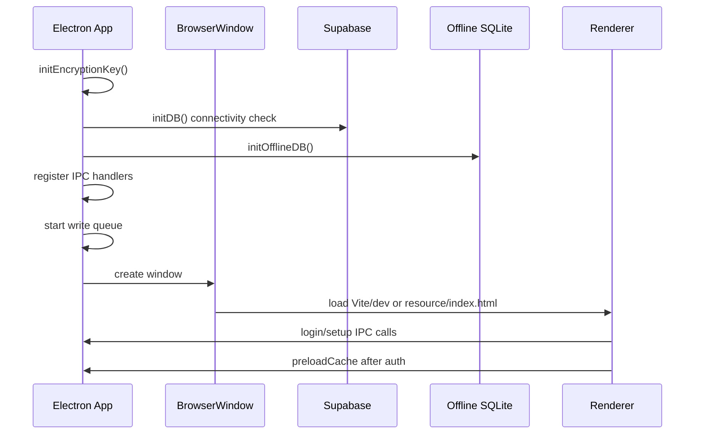

### 10.2 Cached Reads

1. UI requests data through `window.electron`.
2. IPC handler checks memory cache for high-traffic tables where implemented.
3. If cache miss, handler queries Supabase.
4. Rows are decrypted before being returned.
5. Cache can fall back to SQLite table snapshots if Supabase is unavailable.

### 10.3 Write Queue

1. IPC handler enqueues writes instead of blocking UI.
2. Queue stores operation in memory and SQLite `sync_queue`.
3. Drain runs every 300 ms, up to 10 writes at a time.
4. Data is encrypted before Supabase write.
5. On success, SQLite queue entry is removed.
6. Renderer receives `data-updated` event.
7. Failed writes retry with exponential backoff up to 4 attempts.

### 10.4 Product Creation and Model Generation

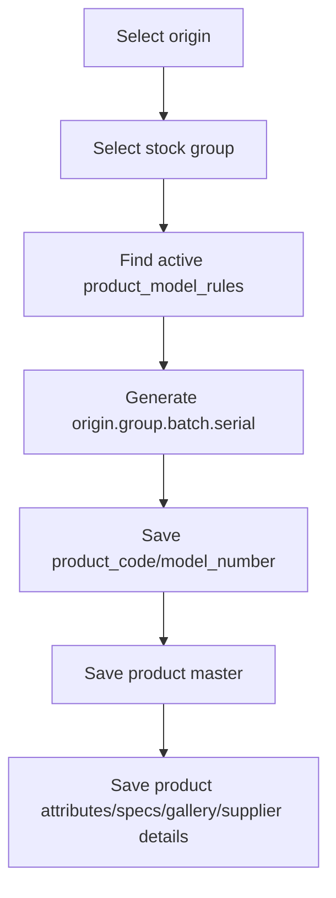

Rules:

- Model number should be generated, not typed manually.
- HSN/SAC has been removed.
- Imported product creation is restricted to superadmin-level permission.
- Additional origins are dynamic through `product_origins`.

### 10.5 Purchase Requisition

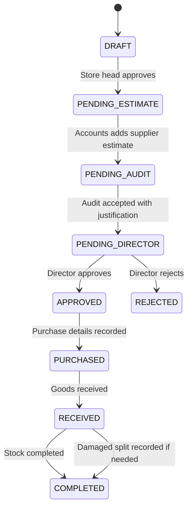

Data captured:

- Header: PR number, priority, required delivery date, status, notes.
- Lines: multiple products, quantities, units.
- Supplier quotes: supplier ledger, estimate, remarks.
- Audit: justification, accepted/rejected state.
- Director: approval/rejection note.
- Purchase: invoice/vendor/purchase amount/details.
- Receive: received quantity and notes.
- Complete: stock posting.
- Logs: approvals and status history.

### 10.6 Damaged Goods

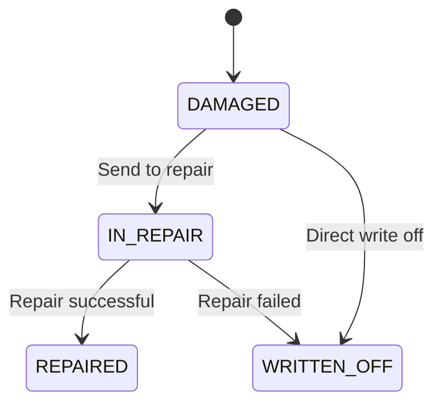

Inventory behavior:

- Usable stock and damaged stock should be shown separately.
- Product ledger should have a damaged goods tab/history.
- Transfer/update operations require `manage_damaged_goods`.

### 10.7 Low Stock Notification

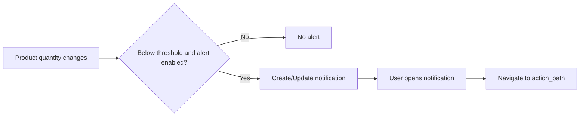

### 10.8 Billing and Shipping

1. Customer selected/created.
2. Bill header and line items are created.
3. Product stock is adjusted.
4. Optional shipping record is upserted.
5. Shipping status log is inserted.
6. Bill audit/system audit log captures changes.
7. Customer ledger surfaces invoice/payment/exchange/address records.

### 10.9 Release Pipeline

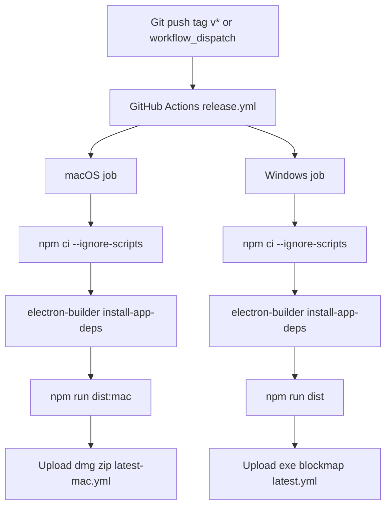

---

## 11. Build and Release Details

### Local Commands

| Command | Purpose |
|---|---|
| `npm run dev` | Vite dev server |
| `npm run build` | TypeScript compile and Vite build |
| `npm run build:check` | TypeScript check without emit |
| `npm run electron:dev` | Electron app in dev mode |
| `npm run dist` | Windows Electron Builder package |
| `npm run dist:mac` | macOS package |
| `npm run dist:publish` | Windows build and publish |
| `npm run dist:mac:publish` | macOS build and publish |
| `npm run dist:all` | macOS + Windows targets from current platform config |
| `npm run manuscript:pdf` | Generate documentation PDF |

### GitHub Workflows

| Workflow | Trigger | Output |
|---|---|---|
| `.github/workflows/release.yml` | `v*` tag or manual dispatch | macOS and Windows release assets |
| `.github/workflows/build-windows.yml` | `main-mac`, `main-windows`, `v*`, manual | Windows NSIS installer and updater metadata |
| `.github/workflows/build-mac.yml` | `main-mac`, manual | macOS DMG/ZIP and updater metadata |

Electron Builder config:

- `appId`: `com.leadingedge.lesoft`
- `productName`: `LESOFT`
- Output directory: `release`
- Windows target: NSIS installer
- macOS target: DMG and ZIP
- Publish provider: GitHub repo `sabbir-404/Leading-Edge-ECO-System`

---

## 12. Security and Data Protection

### Credential Storage

- Supabase URL/anon/service keys are stored in the OS user-data config file, not in Git.
- Embedded encrypted credentials can be decrypted after license validation.
- `supabaseAdmin` is only available when service role key exists.

### Field Encryption

Field encryption is AES-256-GCM using `e1:` ciphertext format.

Skipped structural/search columns include:

- `id`, `*_id`, `auth_id`
- timestamps
- booleans such as `is_active`, `is_read`
- `password_hash`
- `permissions`
- search/link keys such as `invoice_number`, `sku`, `name`, `phone`, `email`, `status`

Important consequence:

- Searchable/linkable fields remain plaintext for app functionality.
- Most sensitive free-text/JSON fields are encrypted before Supabase writes.

### RLS

Some newer tables use permissive `anon full access` policies because the Electron app owns authorization in its IPC/user permission layer. This is practical for the current desktop architecture but should be reviewed before exposing direct web clients.

---

## 13. Migration Timeline

| Migration | Purpose |
|---|---|
| `001_initial_schema.sql` | Base companies, accounting, inventory, products, billing, users, notifications, MAKE, sessions |
| `002_make_enhancements.sql` | MAKE parts, alteration log, app license |
| `003_email_module.sql` | System email |
| `004_hrm_crm.sql` | HRM and CRM base tables |
| `005_rls_security.sql` | RLS/security/auth user linkage |
| `006_enterprise_features.sql` | License binding and presence fields |
| `009_reset_database.sql` | Reset helper |
| `010_quotation_module.sql` | Quotations |
| `011_rls_fixes.sql` | RLS corrections |
| `012_customer_ledger.sql` | Customer payments, addresses, exchanges |
| `013_chat_fix.sql` | Chat messages and typing |
| `014_crm_ledger_merge.sql` | CRM fields on billing customers |
| `015_godowns.sql` | Godowns |
| `016_employee_uid.sql` | Employee code |
| `017_market_analysis.sql` | Product competitor URLs and analysis history |
| `017_permission_levels.sql` | Permission levels |
| `017_product_history.sql` | Product price history |
| `018_delivery_date.sql` | MAKE delivery date |
| `019_fix_bills_altered.sql` | Bill altered flag |
| `020_make_salesman_approval.sql` | MAKE salesman approval |
| `020_payment_methods_table.sql` | Payment methods |
| `021_warehouse_management.sql` | Godown dimensions and product storage location |
| `022_billing_platform.sql` | Billing platform field |
| `023_price_adjustment.sql` | Bill/company price adjustment controls |
| `024_purchase_requisition.sql` | Purchase requisition base |
| `025_supplier_fields.sql` | Supplier fields on ledgers |
| `026_purchase_requisition_audit_settlements.sql` | PR audit/status history/supplier settlements |
| `027_purchase_requisition_items.sql` | Multi-line PR items |
| `028_recovery_restore_products_quantity.sql` | Product quantity/location recovery |
| `029_supplier_store_requisition.sql` | Supplier/store PR support |
| `030_purchase_requisition_quotes.sql` | Supplier quotes/estimates |
| `031_purchase_requisition_workflow_fixes.sql` | PR statuses, quote precision, indexes |
| `032_purchase_requisition_roles.sql` | PR user groups |
| `033_purchase_requisition_permission_levels.sql` | PR permission workflow steps |
| `034_fix_superadmin_group_description.sql` | Super Admin group description repair |
| `035_user_groups_active_flag.sql` | User group disable flag |
| `036_user_delete_fk_integrity.sql` | User delete FK behavior |
| `037_product_ledger_model_attributes.sql` | Product ledger/model/attributes |
| `038_product_model_attributes_rls.sql` | RLS for model/attribute tables |
| `039_remove_product_hsn_and_enforce_generated_model.sql` | Remove HSN/SAC, unique model number |
| `040_dynamic_product_origins.sql` | Dynamic product origins |
| `041_damaged_goods_workflow.sql` | Damaged goods workflow |
| `042_low_stock_alerts_and_notification_routes.sql` | Low stock and notification routing |
| `043_godown_dimensions_schema_fix.sql` | Godown dimension schema compatibility |

---

## 14. Operational Checklist

### First-Time Setup

1. Install dependencies in `LE-SOFT`.
2. Run Supabase migrations in order.
3. Start the app.
4. Complete license/Supabase setup.
5. Create/verify admin and superadmin users.
6. Verify user groups and permissions.

### Migration Verification

Recommended manual smoke test:

- `LE-SOFT/supabase/tests/purchase_product_integration_smoke.sql`

This test is designed to run inside a transaction and `ROLLBACK`, so it validates schema integration without keeping test data.

### Release Verification

1. Confirm `package.json` version.
2. Run type/build check.
3. Build macOS and Windows through GitHub Actions or local builder.
4. Confirm GitHub Release assets:
   - macOS: `.dmg`, `.zip`, `latest-mac.yml`
   - Windows: `.exe`, `.exe.blockmap`, `latest.yml`
5. Confirm updater metadata points to the intended version.

---

## 15. Known Technical Risks and Follow-Up Areas

| Area | Risk | Recommendation |
|---|---|---|
| RLS | Several desktop tables allow anon full access | Keep desktop-only assumption documented; tighten if web/direct clients are introduced |
| Field encryption | Search/link columns remain plaintext | Accept for functionality or introduce dedicated normalized search tokens later |
| Write queue | Some workflows may need strict write ordering | Keep parent/child writes together or add dependency-aware queue operations |
| Migrations | Numbering includes repeated `017` and `020` prefixes | Keep sorted execution order explicit in release docs |
| Purchase requisitions | Legacy single-product columns still exist on header | Treat `purchase_requisition_items` as source of truth for multi-product UI/print |
| Product model generation | App-level generation can race if two users create same serial at once | Consider database function/lock for serial generation |
| Permissions | Frontend navigation hides pages but IPC handlers must remain guarded | Audit every destructive IPC handler for permission checks |
| Email bulk sending | SMTP providers block high-volume bursts | Add queue/rate limit/domain throttling and unsubscribe/compliance features |
| Generated release files | `release` artifacts may drift from source | Prefer CI artifacts as authoritative |
| Offline sync | Conflict resolution is currently simple retry behavior | Add conflict policy for edited rows after reconnect |

---

## 16. Developer Onboarding Notes

### How to Add a New Feature

1. Add or update Supabase migration.
2. Add RLS policy if table is accessed by anon Supabase client.
3. Add IPC handler in `electron/ipc-handlers.ts`.
4. Expose bridge method in `electron/preload.ts`.
5. Add React page/component.
6. Add route in `src/App.tsx`.
7. Add navigation item in `DashboardLayout.tsx` if needed.
8. Add permission key to `permission_levels` and relevant `user_groups`.
9. Add smoke/manual test SQL when feature touches multiple tables.
10. Verify with `npm run build:check` and targeted runtime test.

### How to Debug Data Issues

1. Check the browser error boundary message.
2. Check Electron terminal logs for IPC handler errors.
3. Verify table/column exists in latest migration.
4. Run `NOTIFY pgrst, 'reload schema';` after schema change.
5. Verify RLS policy if insert/update fails with `42501`.
6. Verify exact column names if Supabase returns `PGRST204`.
7. Check encryption skip list if joins/search fail on encrypted fields.
8. Check write queue status if UI changed but Supabase did not update.

### High-Value Files for Future Work

| File | Why it matters |
|---|---|
| `src/App.tsx` | Route registration and global wrappers |
| `src/components/DashboardLayout.tsx` | Navigation, notification routing, permissions |
| `src/components/ProtectedRoute.tsx` | Page authorization |
| `electron/preload.ts` | Renderer API contract |
| `electron/ipc-handlers.ts` | Business backend |
| `electron/supabase.ts` | Supabase configuration |
| `electron/field-encryption.ts` | Data encryption behavior |
| `electron/write-queue.ts` | Async/offline write behavior |
| `electron/cache-manager.ts` | Read cache behavior |
| `supabase/migrations` | Database source of truth |
| `.github/workflows/release.yml` | Cross-platform release source |

---

## 17. Appendix: Print Settings Model

The app preserves print-related settings across logout:

- `barcode_sticker_size`
- `barcode_printer`
- keys beginning with `print_page_size_`

Per-print-option page sizes should use specific keys rather than one global setting. Example pattern:

- `print_page_size_purchase_requisition`
- `print_page_size_bill`
- `print_page_size_quotation`
- `print_page_size_shipping_label`

This lets A4/A5 or other page preferences be isolated by print context.

---

## 18. Appendix: Current Documentation Assets

Existing documentation and visual assets include:

- `docs/LE-SOFT_Manuscript.md`
- `docs/LE-SOFT_Manuscript.pdf`
- `docs/LE-SOFT_Manuscript_Screenshots.pdf`
- `docs/AUTO-UPDATE-SETUP.md`
- `docs/MAC_DISTRIBUTION.md`
- `docs/screenshots/*`

Use this blueprint as the technical reference, and the manuscript/screenshots as user-facing product documentation.
