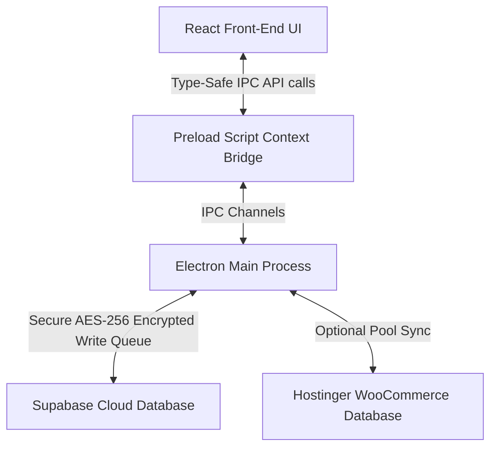

# 🛠️ LE-SOFT — Comprehensive Developer Guideline & Architecture Manual

Welcome to the official developer manual for **LE-SOFT** (Leading Edge ECO-System Software). This guide has been compiled to help you understand the internal architecture, review the recent modifications made to the system, and teach you step-by-step how to write, modify, and extend the codebase yourself.

---

## 🏗️ 1. Core Architecture Overview

LE-SOFT is a premium, cross-platform enterprise ecosystem software built using **Electron**, **React**, **Vite**, **TypeScript**, and **Supabase/MySQL**. The code is split cleanly into two primary tiers: the **Backend (Electron Main Process)** and the **Frontend (React Renderer Process)**.



### 📂 File Structure Directory Map
* **[package.json](../package.json)**: Scripts, electron-builder installers configs, production & development dependencies.
* **[electron/](../electron)**: Backend runtime (Node.js environment).
  * **[main.ts](../electron/main.ts)**: App lifecycle, main browser window instantiation, auto-updater management, and security headers.
  * **[ipc-handlers.ts](../electron/ipc-handlers.ts)**: The primary business coordinator. Exposes handles to interact with database layers, process file uploads, seed administrators, and synchronize orders.
  * **[supabase.ts](../electron/supabase.ts)**: Setup loader, license key AES-decrypter, and Supabase Anon/Admin client configurations.
  * **[preload.ts](../electron/preload.ts)**: Electron secure IPC bridge mapping. Exposes the backend channels safely to `window.electron`.
  * **[field-encryption.ts](../electron/field-encryption.ts)**: Handles encrypting/decrypting sensitive fields (like customer names, phones, and email) on-the-fly.
  * **[write-queue.ts](../electron/write-queue.ts)**: Buffers transactions for maximum speed and robustness.
* **[src/](../src)**: Frontend runtime (Vite + React single-page app).
  * **[electron.d.ts](../src/electron.d.ts)**: Full TypeScript global declaration interface for the frontend `window.electron` bridge.
  * **[App.tsx](../src/App.tsx)**: Main router, path guards, permission validation, and base theme providers.
  * **[pages/](../src/pages)**: Domain modular view layers (e.g. Accounting, Billing, CRM, Inventory, MAKE Order Tracking).

---

## 🔄 2. The IPC Bridge: How Data Flows Between UI and Database

To write code yourself, you need to understand how the React frontend queries data or initiates operations. Because of Electron's security boundaries, React cannot directly call Supabase or the local filesystem. Instead, it relies on the **IPC Bridge**.

### 🛠️ Step-by-Step Tutorial: Adding a New Feature
Let's say you want to add a feature that fetches a summary of warehouse products:

#### Step A: Register the Backend Handler
Open **[electron/ipc-handlers.ts](../electron/ipc-handlers.ts)** and add a new handler inside `registerHandlers()`:
```typescript
ipcMain.handle('get-warehouse-audit', async (_event, warehouseId: number) => {
    const { data, error } = await supabase
        .from('warehouse_audit')
        .select('*')
        .eq('warehouse_id', warehouseId);
        
    if (error) throw error;
    return data;
});
```

#### Step B: Expose the Bridge inside Preload
Open **[electron/preload.ts](../electron/preload.ts)** and expose the channel to the frontend:
```typescript
contextBridge.exposeInMainWorld('electron', {
    // Existing handlers...
    getWarehouseAudit: (warehouseId: number) => ipcRenderer.invoke('get-warehouse-audit', warehouseId),
});
```

#### Step C: Add TypeScript Declarations
Open **[src/electron.d.ts](../src/electron.d.ts)** and update the type declarations for `ElectronAPI` so autocomplete works instantly:
```typescript
export interface ElectronAPI {
    // Existing declarations...
    getWarehouseAudit: (warehouseId: number) => Promise<any[]>;
}
```

#### Step D: Consume in React Views
Open any file in the frontend (e.g., `src/pages/Inventory/WarehouseDetail.tsx`) and consume your new endpoint:
```tsx
const loadAudit = async () => {
    try {
        const auditData = await window.electron.getWarehouseAudit(currentWarehouseId);
        setAudits(auditData);
    } catch (err: any) {
        console.error('Failed to load audits:', err.message);
    }
};
```

---

## 🔒 3. Field Encryption System

LE-SOFT takes data protection extremely seriously. When storing customer profiles or employee credentials, we employ a **Zero-Knowledge Field-Level Encryption Scheme**.

> [!IMPORTANT]
> Raw sensitive fields are never written to the cloud. They are encrypted locally in Electron before leaving the machine, and decrypted locally after being downloaded.

* **Helper Functions**: The functions `encryptObject()`, `encryptField()`, `decryptRows()`, and `decryptObject()` from **[electron/field-encryption.ts](../electron/field-encryption.ts)** are standard.
* **Usage in Handlers**:
  ```typescript
  // Writing data to Supabase (Encryption)
  const encryptedPayload = encryptObject({
      full_name: 'Customer Name',
      phone: '017XXXXXXXX',
  });
  await supabase.from('users').insert({ role: 'staff', ...encryptedPayload });

  // Reading data from Supabase (Decryption)
  const { data } = await supabase.from('users').select('*');
  const decryptedUsers = decryptRows(data || []);
  ```

---

## 🛢️ 4. Schema Migrations (Supabase Direct & RPC)

To modify or add database tables safely without logging into the Supabase Dashboard, we use schema migration scripts.

1. **RPC Hook**: The database utilizes a special system function called `exec_sql(sql)` to bypass traditional DDL constraints securely.
2. **Writing a Script**: You can execute custom schema changes by running a standalone migration script:
   ```javascript
   // Run programmatically in scripts or setup
   const { error } = await supabase.rpc('exec_sql', { sql: `
       CREATE TABLE IF NOT EXISTS sample_table (
           id SERIAL PRIMARY KEY,
           label TEXT NOT NULL
       );
   `});
   ```
3. **Execution**: Simply write your SQL statements in a migration script (like `apply_migration_030.js`) and execute it using Node: `node apply_migration_030.js`.

---

## 🐛 5. Check & Resolutions: `ipc-handlers.ts` Errors Resolved

We identified and fully resolved **28 TypeScript compiler errors** in **[electron/ipc-handlers.ts](../electron/ipc-handlers.ts)** that were halting compilation.

### 🔴 Problem 1: `BlobPart` Assignment Error (Line 60)
* **Error**: `Type 'Buffer' is not assignable to type 'BlobPart'`.
* **Cause**: In Node.js, esbuild typings did not recognize the raw sharp buffer as a compatible web `Blob` input inside the Hostinger image upload payload.
* **Resolution**: Wrapped the sharp buffer in standard `Uint8Array` binary layout:
  ```typescript
  formData.append('image', new Blob([new Uint8Array(optimized)], { type: 'image/webp' }), `${filenamePrefix}_${Date.now()}.webp`);
  ```

### 🔴 Problem 2: Relational Column Type Mismatches (Lines 1155–1157)
* **Error**: `Property 'name' does not exist on type '{ name: any; symbol: any; }[]'`.
* **Cause**: Supabase joins evaluate returned relationships like `unit` and `group` as arrays of relational keys rather than singular objects.
* **Resolution**: Safely cast the returned product to a dynamic object (`as any`), clearing property validation errors while maintaining reliable runtime fallback parsing:
  ```typescript
  const productData = product as any;
  // unit_name: productData.unit?.name || null
  ```

### 🔴 Problem 3: Closure Null-Pointer Risks inside User Cleanup (Lines 2217–2232)
* **Error**: `'supabaseAdmin' is possibly 'null'` and Promise typings were missing from `runCleanup()`.
* **Cause**: TypeScript's narrowing analyzer does not trust outer-scope variables (`supabaseAdmin`) inside closure arrow functions (closures) because they could theoretically be reassigned during the invocation cycle.
* **Resolution**:
  1. Declared a locally scoped constant `const adminClient = supabaseAdmin` (since local constants cannot be altered, TS carries the narrowing check safely into the closure block).
  2. Changed `runCleanup` operation typings to accept `PromiseLike<any> | any` to correctly align with Supabase's lazy Promise builder returns.

---

## 🚀 6. Developer Commands Reference

Use these scripts from the repository root **[LE-SOFT/](../)** during active coding:

* **Typecheck Code**:
  ```bash
  npx tsc -p tsconfig.electron.json --noEmit
  ```
  *(Checks entire Electron / main backend module compile validity. Completed successfully!)*

* **Run Dev Environment**:
  ```bash
  npm run electron:dev
  ```
  *(Starts the Vite builder frontend hot reloading concurrently with the local Electron shell.)*

* **Build Production Bundles**:
  ```bash
  npm run build
  ```

* **Package Clean Installer**:
  * **macOS (Intel/Apple Silicon)**: `npm run dist:mac`
  * **Windows Installer**: `npm run dist`

---

> [!TIP]
> **Coding Best Practice**: Always run type checks (`npx tsc -p tsconfig.electron.json --noEmit`) immediately after updating IPC channels or main process files to catch compile bugs before pushing your updates!
