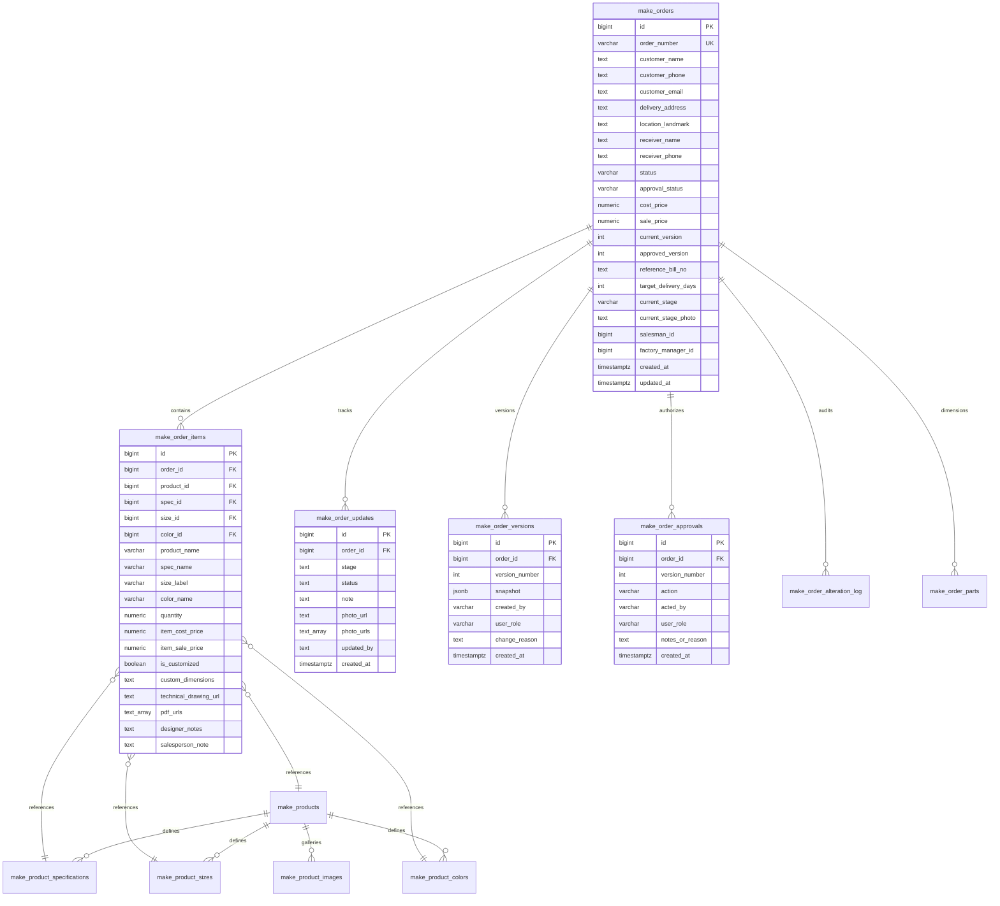
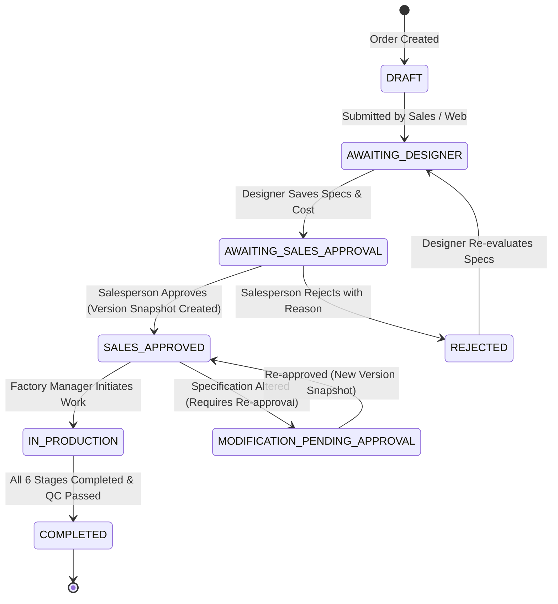

# MAKE Module — Target Architecture Specification (Make V1)

**Document Version**: 1.0.0  
**Date**: 2026-09-20  
**Target Scope**: Electron Main Process Domain Services, IPC Perimeter, Database Schemas, Storage Security, UI Integration  

---

## 1. ARCHITECTURAL TOPOLOGY & SERVICE LAYER

The MAKE module is structured as a dedicated domain layer inside the Electron Main process. The React views (`PlaceOrder.tsx`, `TrackOrders.tsx`, `AlterOrder.tsx`, `MakeProductCatalog.tsx`, `MakeDashboard.tsx`) serve strictly as presentation layers.

```text
+-------------------------------------------------------------------------+
|                         MAKE FRONTEND (REACT UI)                        |
|   - PlaceOrder.tsx (Form state, customer inputs, catalog picker)        |
|   - TrackOrders.tsx (Kanban display, photo selection, approval UI)      |
|   - AlterOrder.tsx (Modification modal, version diff viewer)            |
|   - MakeProductCatalog.tsx (Template manager, spec editor)              |
|   - MakeDashboard.tsx (KPI cards, order throughput charts)              |
+-------------------------------------------------------------------------+
                                    |
                                    | window.electron.* (IPC Invoke)
                                    | Passes Session Token + Pure Data Payload
                                    v
+-------------------------------------------------------------------------+
|                         SECURE MAKE IPC GATEWAY                         |
|   - Zod Schema Validation (makeOrderSchema, stageUpdateSchema, etc.)    |
|   - Session Authenticator (Extracts actor ID & role from Main token)    |
|   - Permission Guard (Checks 'write_make', 'approve_make_order', etc.)  |
+-------------------------------------------------------------------------+
                                    |
                                    v
+-------------------------------------------------------------------------+
|                        MAKE APPLICATION SERVICES                        |
|                                                                         |
|   +-----------------------+   +------------------------------------+    |
|   |   MakeOrderService    |   |         MakePricingService         |    |
|   | - Order creation      |   | - Server-side cost/sale validation |    |
|   | - Multi-item packing  |   | - Dimension price adjustments      |    |
|   | - Status orchestration|   | - Historical price snapshots       |    |
|   +-----------------------+   +------------------------------------+    |
|               |                                  |                      |
|   +-----------------------+   +------------------------------------+    |
|   |   MakeOrderService    |   |         MakePricingService         |    |
|   | - Order creation      |   | - Server-side cost/sale validation |    |
|   | - Multi-item packing  |   | - Dimension price adjustments      |    |
|   | - Status orchestration|   | - Historical price snapshots       |    |
|   +-----------------------+   +------------------------------------+    |
|               |                                  |                      |
|   +-----------------------+   +------------------------------------+    |
|   | MakeProductionService |   |         MakeVersionService         |    |
|   | - 8-stage state mach  |   | - Immutable JSONB order snapshots  |    |
|   | - Stage photo handler |   | - Approval log recording           |    |
|   | - Transition validator|   | - Version diff calculation         |    |
|   +-----------------------+   +------------------------------------+    |
|               |                                  |                      |
|   +-----------------------+   +------------------------------------+    |
|   |   MakeSearchService   |   |           MakeCadService           |    |
|   | - Whole-catalog search|   | - Native file dialog invocation    |    |
|   | - Relevance scoring   |   | - Magic byte MIME & ext validation |    |
|   | - Multi-token matching|   | - Invoice attachment buffer upload |    |
|   +-----------------------+   +------------------------------------+    |
+-------------------------------------------------------------------------+
                                    |
                                    v
+-------------------------------------------------------------------------+
|                   DATA ACCESS & STORAGE INTEGRATION                     |
|  - PostgreSQL (make_* tables via PostgREST & Supabase Client)           |
|  - Local SQLite Cache & Outbox (`sync_queue`)                           |
|  - TrueNAS File Storage Server (`https://storage.lenas.me`)              |
|  - Tamper-Evident Merkle Chain (`crypto_audit_logs`)                    |
+-------------------------------------------------------------------------+
```

---

## 2. DOMAIN ENTITY RELATIONSHIPS (ER DIAGRAM)



---

## 3. ORDER & APPROVAL LIFECYCLE STATE MACHINE

Custom orders flow through a controlled lifecycle. Status transitions are enforced by `MakeOrderService`:



---

## 4. PRODUCTION STAGE PROGRESSION STATE MACHINE

The physical factory production stages must be completed **strictly sequentially**. Transitions are enforced by `MakeProductionService`. Stage skipping is strictly rejected:

```mermaid
stateDiagram-v2
    direction LR
    [*] --> Stage1
    Stage1: 1. Cutting & Woodworking\n(Raw timber cutting, frame assembly)
    Stage2: 2. Metalwork\n(Welding, structural reinforcement)
    Stage3: 3. Polish & Paint\n(Sanding, primer, lacquer, color)
    Stage4: 4. Upholstery\n(Foam, fabric stitching, fitting)
    Stage5: 5. Packaging & QC\n(Quality inspection, protective wrap)
    Stage6: 6. Dispatch\n(Loading, delivery manifest, handover)

    Stage1 --> Stage2 : Complete + Photo Upload
    Stage2 --> Stage3 : Complete + Photo Upload
    Stage3 --> Stage4 : Complete + Photo Upload
    Stage4 --> Stage5 : Complete + Photo Upload
    Stage5 --> Stage6 : Final QC Passed + Packaging Photo
    Stage6 --> [*] : Delivery Confirmed
```



### Stage Transition Rules:
1. **Linear Ordering**: A stage cannot be activated unless the immediately preceding stage has been recorded as complete in `make_order_updates`.
2. **Actor Verification**: The actor advancing the stage must belong to the `Factory Manager`, `Production`, or `Admin` user group.
3. **Mandatory Photo Verification**: Stages 1 through 5 require at least one photo upload before transition is allowed.
4. **Current Stage Mirroring**: Advancing a stage updates `make_orders.status`, `make_orders.current_stage`, and `make_orders.current_stage_photo`.

---

## 5. SERVICE LAYER SPECIFICATION

### 5.1 `MakeOrderService` (`electron/services/make/MakeOrderService.ts`)
* `createOrder(orderInput, actorSession)`:
  * Generates unique order number: `MAKE-YYYY-XXXX` (atomic sequence).
  * Validates customer information and items array.
  * Persists `make_orders` and `make_order_items` in a transactional boundary.
  * Inserts initial record in `make_order_updates`.
  * Logs to `system_audit_log` via `crypto-audit.ts`.
* `getOrderById(orderId)`: Fetches order with associated items, drawings, and version info.
* `listOrders(filters)`: Retrieves orders filtered by status, priority, date range, or salesman.

### 5.2 `MakePricingService` (`electron/services/make/MakePricingService.ts`)
* `validateAndCalculatePricing(items)`:
  * Validates that every item has a valid numeric cost price $> 0$.
  * Ensures sale price is greater than or equal to cost price (unless authorized by manager).
  * Computes deterministic order totals (`cost_price`, `sale_price`).
* `saveDesignerPricing(orderId, pricingData, actorSession)`:
  * Verifies actor has `Designer` or `Admin` role.
  * Updates item pricing and designer notes.
  * If order was previously approved, triggers `MakeVersionService.createSnapshot()` and increments `current_version`.
  * Advances order status to `Awaiting Salesperson Approval`.

### 5.3 `MakeProductionService` (`electron/services/make/MakeProductionService.ts`)
* `advanceStage(orderId, targetStage, note, photoBuffer, mimeType, actorSession)`:
  * Validates actor has `Factory Manager` or `Admin` capability.
  * Enforces strictly sequential transition ($S_{n} \rightarrow S_{n+1}$).
  * Calls `MakeCadService` to upload completion photo to secure storage.
  * Updates `make_orders` and inserts into `make_order_updates`.
  * Dispatches real-time notification to assigned salesperson and designer.

### 5.4 `MakeVersionService` (`electron/services/make/MakeVersionService.ts`)
* `createSnapshot(orderId, changeReason, actorSession)`:
  * Pulls current live record of `make_orders` and all related `make_order_items`.
  * Serializes complete order state into a JSONB document.
  * Inserts into `make_order_versions` with `version_number`.
  * Records approval in `make_order_approvals` when triggered by salesperson approval.
* `getVersionDiff(orderId, fromVersion, toVersion)`:
  * Computes deep diff between version snapshots for visual comparison in `AlterOrder.tsx`.

### 5.5 `MakeCadService` (`electron/services/make/MakeCadService.ts`)
* `uploadDrawing(orderId, itemId, fileBuffer, fileName, actorSession)`:
  * Validates file header magic bytes (forbids arbitrary executables or scripts).
  * Generates unique storage key: `make-order-files/{orderId}/items/{itemId}/{timestamp}_{hash}.{ext}`.
  * Transfers buffer to TrueNAS storage server via Cloudflare Tunnel.
  * Updates `make_order_items.pdf_urls` and `make_order_items.technical_drawing_url`.
* `downloadDrawing(storagePath)`: Generates authenticated signed download URL or temporary local preview stream.

---

## 6. SECURE IPC BOUNDARY (ZOD SCHEMAS)

Every Make IPC channel is bound to a strict Zod runtime schema:

```typescript
// Example: make.schema.ts
import { z } from 'zod';

export const CreateMakeOrderSchema = z.object({
  customer_name: z.string().min(1, 'Customer name is required').max(255),
  customer_phone: z.string().min(7, 'Valid phone number required').max(50),
  customer_email: z.string().email().optional().or(z.literal('')),
  shipping_address: z.string().min(1, 'Delivery address is required'),
  target_delivery_date: z.string().regex(/^\d{4}-\d{2}-\d{2}$/, 'Valid date required (YYYY-MM-DD)'),
  priority: z.enum(['Low', 'Normal', 'High', 'Urgent']).default('Normal'),
  salesman_id: z.number().int().positive().nullable().optional(),
  special_instructions: z.string().optional(),
  items: z.array(z.object({
    product_id: z.number().int().positive().nullable().optional(),
    product_name: z.string().min(1, 'Item name is required'),
    spec_id: z.number().int().positive().nullable().optional(),
    spec_name: z.string().optional(),
    size_id: z.number().int().positive().nullable().optional(),
    dimensions_text: z.string().optional(),
    color_id: z.number().int().positive().nullable().optional(),
    color_name: z.string().optional(),
    quantity: z.number().positive().default(1),
    is_customized: z.boolean().default(false),
    custom_dimensions: z.string().optional(),
    designer_notes: z.string().optional()
  })).min(1, 'At least one item is required')
});

export const UpdateProductionStageSchema = z.object({
  orderId: z.number().int().positive(),
  stage: z.string().min(1),
  note: z.string().optional(),
  photoBase64: z.string().optional()
});
```

---

## 7. AUDIT & CRYPTOGRAPHIC TRAIL INTEGRATION

Every critical Make lifecycle event triggers an immutable audit log entry:
1. `ORDER_CREATED`: Order placed with items count and customer.
2. `DESIGNER_PRICED`: Cost price and specifications set by designer.
3. `ORDER_APPROVED`: Salesperson approval, generating Version 1 snapshot.
4. `ORDER_ALTERED`: Order specifications modified, generating new version.
5. `STAGE_ADVANCED`: Production advanced from Stage $N-1$ to Stage $N$ with photo attachment.
6. `DRAWING_UPLOADED`: CAD blueprint attached to specific item.

Each entry is hashed and appended to the SHA-256 Merkle chain in `crypto_audit_logs`.
