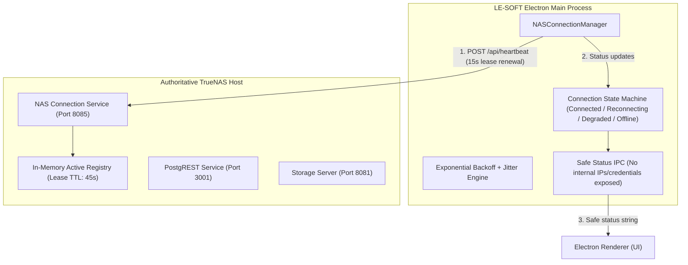

# NAS Smart Connection Manager Architecture & Deployment Specification

## 1. Overview
The **NAS Smart Connection Manager** provides deterministic, resilient connection management between LE-SOFT desktop clients and the authoritative TrueNAS storage & database host.

Instead of keeping fragile permanent TCP connections or simply increasing timeouts (which cause UI freezes), the system utilizes **heartbeat and lease semantics** paired with **exponential backoff and jitter** to guarantee graceful fault tolerance.

---

## 2. Architecture & Components



---

## 3. Client State Machine & Classification

The `NASConnectionManager` actively classifies the environment into four clear states:

| Safe Renderer State | Real-World Network Condition | Action Taken |
| :--- | :--- | :--- |
| **Connected** | NAS is online, heartbeat acknowledged, lease active | Normal operational flow. Immediate query execution against NAS master. |
| **Reconnecting** | Heartbeat missed or transient network reset | Backoff timer active with random jitter (2s-30s + 500-1500ms). Single in-flight loop. |
| **Degraded** | High latency (>2500ms) or PostgREST healthy while auxiliary service slow | Transparent read/write failover protection enabled. |
| **Offline** | Client interface down or NAS completely unreachable past circuit breaker | Fallback writes journaled to local disk, automatic recovery upon reconnection. |

### Differentiating Fault Scenarios:
1. **"NAS online, but this client disconnected":**
   The client verifies whether internet/cloud endpoints respond. If Supabase Cloud is reachable but NAS endpoints time out, this client is marked **Offline / Reconnecting to NAS** while cloud sync buffers.
2. **"NAS itself is unavailable":**
   The client receives no TCP response across LAN, Tailscale (`100.88.85.6`), and Cloudflare Tunnel (`db.lenas.me`). The failover circuit breaker activates and switches to Supabase cloud fallback without crashing.
3. **"Server/API unhealthy":**
   Heartbeat or storage endpoints return HTTP 500/502 while network is intact.

---

## 4. TrueNAS SCALE Production Deployment Specification

The authoritative service is deployed as a persistent Docker container managed by Docker Compose under `/mnt/data_pool/lesoft/nas-connection-service` on TrueNAS SCALE 25.10.7.

### Verified Production Configuration
- **Runtime / Manager**: Docker Compose (`version: '3.8'`)
- **Container Name**: `lesoft-connection-manager`
- **Image**: `node:20-alpine`
- **Deployment Directory**: `/mnt/data_pool/lesoft/nas-connection-service`
- **Mounted Application Code**: `/app/nas-connection-service.js` (pure Node.js with `pg` dependency)
- **Port Mapping**: `8085:8085` (host gateway access: `host.docker.internal:host-gateway`)
- **Restart Policy**: `always`
- **Healthcheck**: `wget -qO- http://127.0.0.1:8085/health` (interval 15s, timeout 3s, retries 3)
- **Environment File**: `.env` (file mode `0600`, owned by `truenas_admin:builtin_administrators`)
  - `PORT=8085`
  - `ADMIN_SECRET=<secure-random-token>`
  - `PGHOST=host.docker.internal`
  - `PGPORT=5432`
  - `PGDATABASE=lesoft`
  - `PGUSER=nas_connection_service`
  - `PGPASSWORD=<dedicated-role-password>`
  - `NODE_ENV=production`

### Docker Compose Reference (`/mnt/data_pool/lesoft/nas-connection-service/docker-compose.yml`)
```yaml
version: '3.8'

services:
  connection-manager:
    image: node:20-alpine
    container_name: lesoft-connection-manager
    restart: always
    working_dir: /app
    volumes:
      - /mnt/data_pool/lesoft/nas-connection-service:/app
    env_file:
      - .env
    command: sh -c "npm install --production && node nas-connection-service.js"
    ports:
      - "8085:8085"
    extra_hosts:
      - "host.docker.internal:host-gateway"
    healthcheck:
      test: ["CMD", "wget", "-qO-", "http://127.0.0.1:8085/health"]
      interval: 15s
      timeout: 3s
      retries: 3
```

---

## 5. Security & Privacy Guarantees

1. **Zero Internals Exposed to Renderer:**
   The renderer receives only:
   ```json
   {
     "status": "Connected",
     "lastSync": 1791482000000,
     "isNasOnline": true
   }
   ```
   **NEVER exposed:**
   - NAS LAN IP (`192.168.1.14`)
   - Tailscale IP (`100.88.85.6`)
   - Hostnames or DNS endpoints
   - Database credentials or auth tokens
   - Physical filesystem storage paths

2. **Stable Anonymous Installation ID:**
   Client identification uses a cryptographically random UUID generated at initial launch and stored locally in the secure user directory (`userData/installation_id.json`). It carries zero user, device name, or MAC address identifiers.
